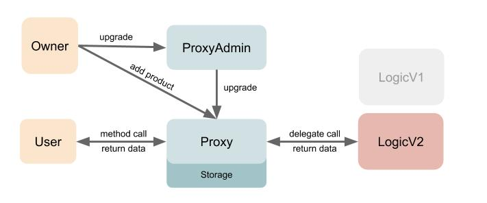

# Staking SANs

## Description

This repository contains smart contracts for ethereum as training task for santiment.net.

## Requirements

1. Function `hasAccess(address,product)->bool` must return whether a given address has access to a given Sanbase 
   product.
2. Function `votes(address)->uint256` which will return how many votes a given address has for governance purposes.
   The number of votes for a user is equal to the balance of a user's tokens + 2x the number of SAN tokens locked in 
   Uniswap. So Uniswap-locked tokens will have higher weight.
3. It should be possible to update the logic of the contract. 
4. Initially, the contract logic can be updated by a person, but later we should be able to set up a governance contract 
   which will be managed by voting and which will perform the logic update operations.

### [Proxy Upgrade Pattern](https://docs.openzeppelin.com/upgrades-plugins/1.x/proxies)

I choose approach proxy upgrade pattern, as it has more flexibility and less hardcode for upgrading contracts. 
It uses `delegatecall` at implementation. 

I use *EIP-1967: Standard Proxy Storage Slots* to avoid storage collisions and to have more transparency for blockchain explorers. 
Developer has to avoid and check storage collisions during upgrading versions between proxy-logic and logic contracts.

I use intermediate contract `ProxyAdmin` to avoid clashing attack. Owner of the proxy admin is responsible for upgrading 
implementation. Owner of the logic contracts is used for access control. Ownership can be transferred to governance contract.

### Diagram

### Local testing

* Launch ganache-cli:
  > `ganache-cli`
* In another terminal install dependencies:
  > `npm i`
* Deploy tokens and pools:
  > `npm run test-deploy`
* Start test:
  > `npm test`

### Ropsten testnet

* [SAN token](https://ropsten.etherscan.io/address/0xBD49501333f8545e5c769d35E1f317B9722EEa64)
* [ETH token](https://ropsten.etherscan.io/address/0xa9aA465293b5A46b2638Ca79b288780075070495)
* [BAC token](https://ropsten.etherscan.io/address/0xC2C9d118B77bC6210d89aEF28768a71aA91559F7)
* [SAN/ETH pair](https://ropsten.etherscan.io/address/0x03c35780fbff99106e408f0372a7a245cb238b0c)
* [SAN/ETH uniswap](https://app.uniswap.org/#/swap?inputCurrency=0xBD49501333f8545e5c769d35E1f317B9722EEa64&outputCurrency=0xa9aA465293b5A46b2638Ca79b288780075070495)
* [SAN/BAC pair](https://ropsten.etherscan.io/address/0x664e3320a767ddbc3ea34ed6579112dfd7b8e1aa)
* [SAN/BAC uniswap](https://app.uniswap.org/#/swap?inputCurrency=0xBD49501333f8545e5c769d35E1f317B9722EEa64&outputCurrency=0xC2C9d118B77bC6210d89aEF28768a71aA91559F7)
* [SanProxyAdmin](https://ropsten.etherscan.io/address/0x579f1Ea0346be12cb865D4cF2b6e4dA41cA31c5F)
* [SanStakingLogicV1](https://ropsten.etherscan.io/address/0x8683049007E5ad88C4A425656a2EE32d169CE2D9)
* [SanStakingLogicV2](https://ropsten.etherscan.io/address/0x0bCF9e0A8ED0fd960346659Bf1116eC6821B5F91)
* [SanStakingProxy](https://ropsten.etherscan.io/address/0xc2Eb484059bC0b419a98BCB9B3a3b707a3F5a804)
